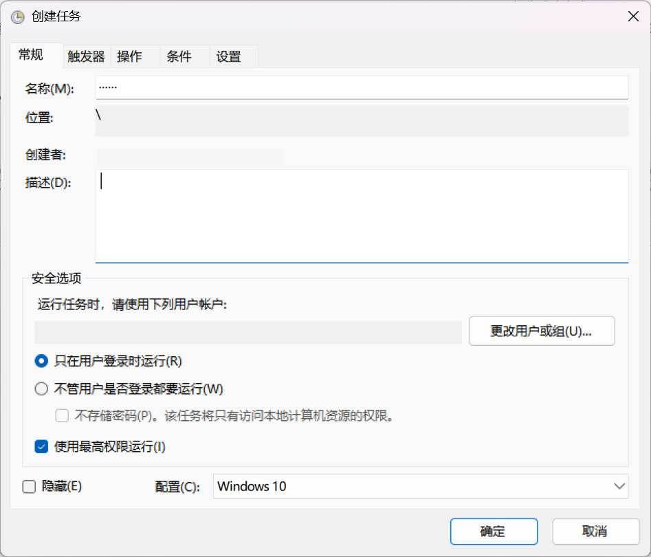
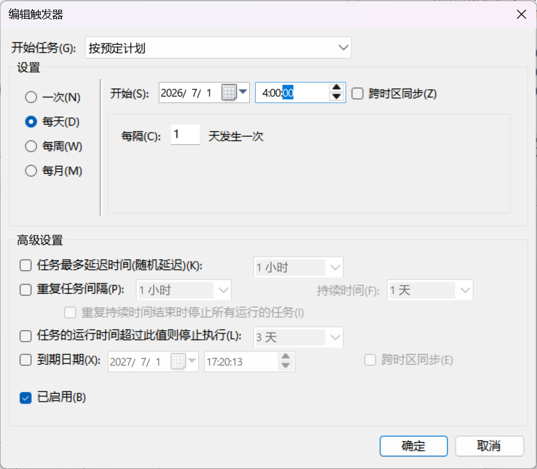
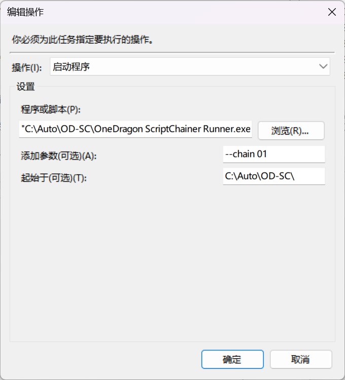

使用本页说明的功能时，建议阅读以下内容：
::: important

- 你可以使用 Windows 任务计划程序定时运行bat或exe
- 因为 [Windows 任务计划程序中的优先级](https://vielhuber.de/zh-cn/blog-zh-cn/prioritaet-in-der-windows-aufgabenplanung-zh-cn/)，其启动某些脚本可能会遇到无法复现的神秘问题
:::

其实你可以放心使用 Windows 任务计划程序定时运行脚本，例如 bat 或 exe

1. 在开始菜单中搜索并打开 `任务计划程序`
2. 在 `任务计划程序库` 选择 `创建任务`

3. 常规页面填写 (可按需修改)
   - 名称随意
   - 勾选 `只在用户登录时运行`
   - 勾选 `使用最高权限运行`
   - 配置选择 `Windows 10` (或11)

   

4. 触发器页面填写 (可按需修改)
   - 点击 `新建`
   - 设置里选择 `每天`
   - 更改要开始运行的时间，例如 `04:00:00`
   - 确定

   

5. 操作页面填写 (可按需修改)
   - 点击 `新建`
   - 程序或脚本里点击 `浏览` 选择好你的脚本路径
   - 添加参数，按需填写
   - 确定

   

6. 条件和设置页面保持默认即可
