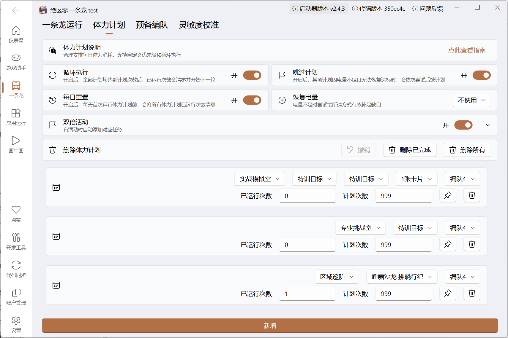

使用本页说明的功能时，建议阅读以下内容：
::: important

- **体力计划** 配置的是 `实战模拟室`、`区域巡防`、`专业挑战室`、`恶名狩猎 深度追猎`
- 其中 `恶名狩猎 深度追猎` 属于需要消耗电量的模式，游戏内需要完成周期挑战才会打开入口
- 另外 `恶名狩猎 深度追猎` 与[恶名狩猎](./notorious_hunt.md)里的 `恶名狩猎 周期挑战` 不是同一个模式
:::

## 功能说明

体力计划是「体力刷本」功能的配置页面。脚本会先读取当前电量，再按列表顺序执行还没达到 `计划次数` 的计划。

## 配置说明

在「一条龙」页面点击 `体力刷本` 的 ⚙️ 图标进入配置。

1. 循环执行
   - `循环执行`：开启后，当所有可执行计划都达到 `计划次数`，脚本会把每条计划的 `已运行次数` 减去对应的 `计划次数`，再继续下一轮。
   - 关闭后，全部计划达到 `计划次数` 时结束本次运行，不再自动开启下一轮。
2. 跳过计划
   - `跳过计划`：开启后，当前计划因电量不足且无法恢复达标时，会依次尝试后续计划。
   - 关闭后，遇到这类电量不足情况会结束本次运行。
   - 代理人方案（特训目标）已达成、周期挑战还有剩余奖励次数导致深度追猎暂不执行、单条计划执行失败等情况不受这个开关影响，会在本次运行内临时跳过当前计划，避免卡在同一条计划反复重试。
3. 每日重置
   - `每日重置`：默认关闭。开启后，每天首次运行体力计划前，会按游戏刷新日把所有计划的 `已运行次数` 清零。
   - 每日重置只影响当天首次运行前的计划进度；不会改变 `循环执行` 的一轮扣减逻辑。
4. 恢复电量
   - `恢复电量`：电量不足时是否使用恢复来源，可选 `不使用`、`使用储蓄电量`、`使用以太电池`、`同时使用储蓄电量和以太电池`。
   - 脚本会先在菜单里按计划类型预估所需电量：`实战模拟室` 默认 `20` 点，选择 `1` 到 `5` 张卡片时按卡片数量乘以 `20` 点；`区域巡防` 为 `60` 点；`专业挑战室` 为 `40` 点；`恶名狩猎 深度追猎` 为 `60` 点。
   - 如果当前电量不够，脚本会先预读所选恢复来源是否够用；够用才继续进本，真正的恢复确认会在副本内点 `下一步` 后，或战斗结束后点 `再来一次` 触发恢复弹窗时执行。
   - 同时使用两种来源时，会先尝试储蓄电量；储蓄电量不足再尝试以太电池。最终仍不足时，按 `跳过计划` 的设置继续后续计划或结束本次运行。
5. 双倍活动
   - `启用双倍活动`：开启后，体力计划会在识别当前电量后进入 `实战模拟室`，检查是否出现 `每日怪物卡双倍掉落次数`。
   - 检测到实战模拟室双倍次数时，脚本会临时插入一条双倍计划，并优先执行这条计划；没有检测到双倍次数、识别到剩余次数为 0，或当前电量不足 20 点时，会按普通体力计划继续运行。
   - 双倍活动里的 `实战模拟室` 配置用于选择要刷的材料、编队和自动战斗配置。卡片数量不在这里手动填写，脚本会按 `当前电量 / 20` 和游戏内剩余双倍次数取较小值，最多使用当天剩余的双倍次数。
   - 这条双倍计划只在本次运行中临时生效，不会添加到下方计划列表，也不会占用普通计划的 `已运行次数 / 计划次数`。
   - 当前自动识别只覆盖 `实战模拟室` 的每日怪物卡双倍掉落；驱动盘等其他双倍活动不会单独识别。
6. 计划管理
   - 点击 `新增` 添加计划，拖拽可调整执行顺序。
   - 单条计划支持置顶或删除；也可以用 `删除已完成`、`删除所有` 批量清理，误删后可点 `撤销` 恢复。
   - `副本分类 / 副本内容`：选择要刷的副本类型和具体目标。
   - `实战模拟室卡片数量`：选择 `默认数量` 时沿用游戏当前数量；选择 `1` 到 `5` 张卡片时，脚本会重新选择并保存。
   - `恶名狩猎 buff`：仅深度追猎显示，用于选择进入副本时使用第几个 buff。
   - `编队 / 自动战斗配置`：可使用游戏内配队，也可指定预备编队；指定预备编队时，会使用该预备编队保存的自动战斗配置。
   - `已运行次数 / 计划次数`：控制本轮还要刷多少次；`计划次数` 填 `0` 时，本轮不会执行这条计划。

## 典型使用方式

**常驻刷养成材料，活动期间优先消耗双倍**

1. 开启 `循环执行`、`跳过计划` 和 `每日重置`，让这套计划每天都从 0 次开始，并在某条计划暂时刷不了时继续尝试后续计划。
2. `恢复电量` 选 `不使用` 时，脚本只消耗自然恢复的电量；如果希望自动使用储蓄电量或以太电池，再改成对应选项。
3. 有实战模拟室双倍掉落活动时，开启 `双倍活动`，并在双倍配置里选择优先消耗双倍次数的材料。
4. 下方计划列表按优先级放入日常要刷的本，例如 `专业挑战室`、`实战模拟室`、`区域巡防` 等。
5. 长期循环使用时，可以把 `计划次数` 设得较大；脚本会受当前电量、恢复电量配置和每日重置共同控制，不会因为次数大就无限刷。

这样脚本会先尝试消耗实战模拟室活动双倍次数，再按计划列表顺序刷日常材料；电量不足且无法恢复达标时，开启 `跳过计划` 会继续尝试后续计划，关闭则会结束本次运行。代理人方案已完成、深度追猎暂不满足执行条件、单条计划执行失败等情况不受 `跳过计划` 控制，脚本会临时跳过当前计划，避免卡在同一条计划反复重试。

::: tip
如果体力计划列表为空，或所有计划的 `计划次数` 都是 0，脚本会跳过体力刷本这个步骤。
:::

