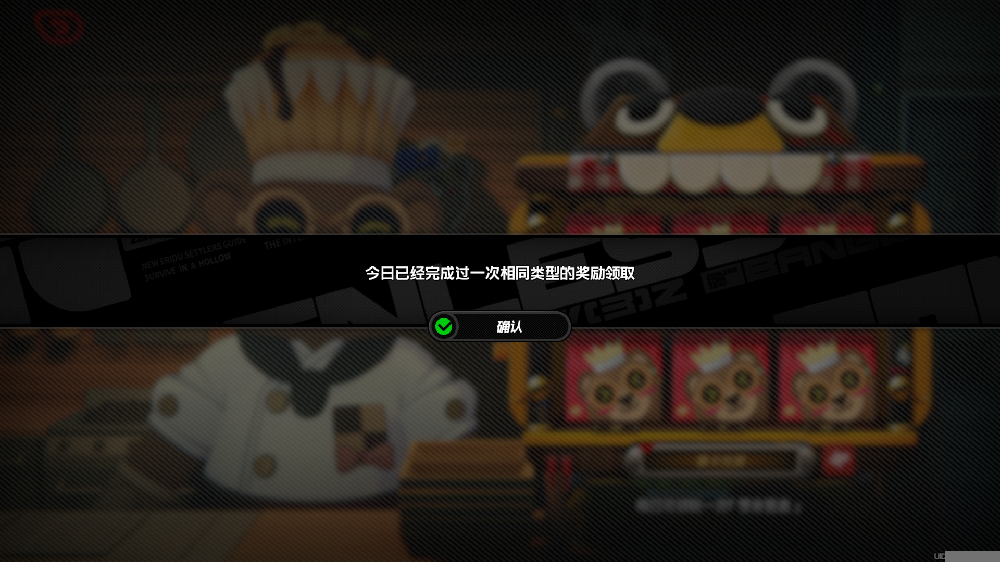

## 功能说明

每天自动执行一次每日签到。当前可选择 `吼吼饼铺`、`卦象集录` 或 `刮刮卡`，脚本会按配置运行其中一个签到项目。

这三个项目属于同一类每日奖励，游戏每天只能领取其中一个。如果今天已经完成过任意一个，继续尝试其他项目时会出现 `今日已经完成过一次相同类型的奖励领取` 提示；脚本识别到这类提示后，会把每日签到视为当天已完成。

## 配置说明

在「一条龙」页面点击 `每日签到` 的 ⚙️ 图标进入配置。

### 1. 选择签到商店

选择每天要执行哪个签到：

- **吼吼饼铺**：前往 `布亚斯特城区-吼吼饼铺` 领取零食盲盒。
- **卦象集录**：前往 `澄辉坪-阿朔` 完成卦象集录。
- **刮刮卡**：前往 `六分街-报刊亭` 完成刮刮卡。

旧版本里 `吼吼饼铺`、`卦象集录`、`刮刮卡` 是一条龙里的三个独立项目；现在统一收进 `每日签到`，一条龙里只需要启用这个项目并选择其中一个签到商店。

