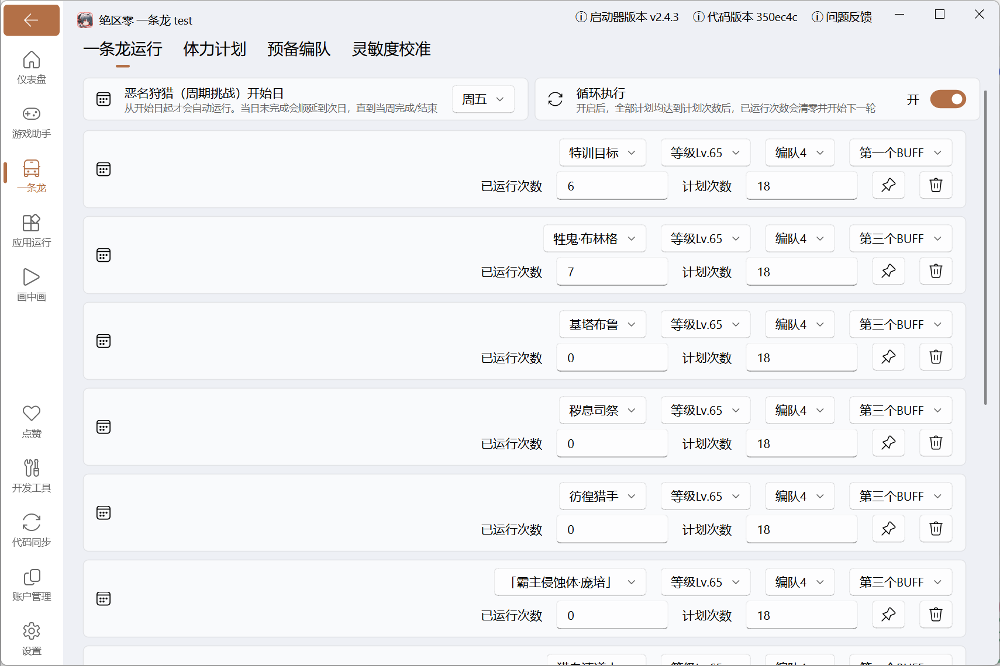

使用本页说明的功能时，建议阅读以下内容：
::: important

- **恶名狩猎** 配置的是 `恶名狩猎 周期挑战`，每周最多 `3` 次奖励次数
- 其中 `恶名狩猎 周期挑战` 属于不用消耗电量的模式，单独维护一套配置
- 另外 `恶名狩猎 周期挑战` 与[体力计划](./charge_plan.md)里的 `恶名狩猎 深度追猎` 不是同一个模式
:::

## 功能说明

用于配置「恶名狩猎 周期挑战」的执行计划。脚本进入挑战页后会读取游戏内当前剩余次数，如果你已经手动打过几次，也会按真实剩余次数继续执行或结束。

## 配置说明

在「一条龙」页面点击 `恶名狩猎` 的 ⚙️ 图标进入配置。

1. 开始日
   - `恶名狩猎（周期挑战）开始日`：从设定的周几开始，脚本才会自动调度本周的恶名狩猎周期挑战，默认为 `周一`。
   - 例子：设为 `周五` 时，周一到周四不会自动跑；从周五开始才会尝试执行。
   - 若开始日当天没有打完剩余奖励次数，后续几天会继续补跑，直到本周完成或本周结束。
2. 循环执行
   - `循环执行`：开启后，当所有可执行计划都达到 `计划次数`，脚本会把每条计划的 `已运行次数` 减去对应的 `计划次数`，再继续下一轮。
   - 循环只影响计划进度；本周剩余奖励次数耗尽时会结束本周，不会继续刷无奖励次数。
   - 关闭后，全部计划达到 `计划次数` 时结束本次运行，不再自动开启下一轮。
3. 计划管理
   - 点击 `新增` 添加计划，拖拽可调整执行顺序。
   - 单条计划支持置顶或删除，脚本会按列表顺序尝试执行还没完成的计划。
   - `恶名狩猎目标 / 等级`：选择要挑战的周期挑战副本和难度，等级默认使用 `默认等级`。
   - `恶名狩猎编队 / 自动战斗`：可使用游戏内配队，也可指定预备编队；指定预备编队时，会使用该预备编队保存的自动战斗配置。
   - `恶名狩猎 buff`：选择进入副本时使用第几个 buff，默认为第一个。
   - `已运行次数 / 计划次数`：控制当前计划还要打多少次；`计划次数` 填 `0` 时，本轮不会执行这条计划。
   - 实际挑战次数还会受游戏内剩余奖励次数限制；计划没跑满但剩余次数为 `0` 时，也会结束本周。

