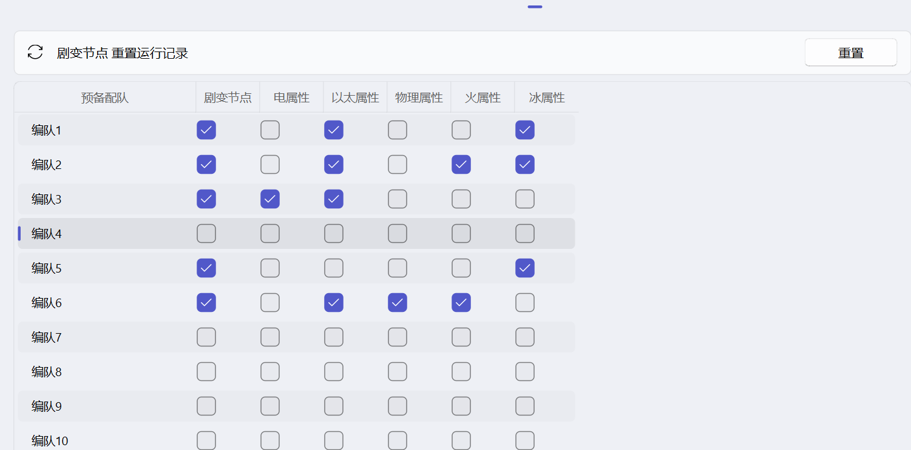

使用本页说明的功能时，建议阅读以下内容：
::: important

- 需要先完成[预备编队](./onedragon.md#预备编队)的配置
- 需要在式舆防卫战的设置页中的对应配队勾选是否参与剧变节点
- 需要在式舆防卫战的设置页中的对应配队尽量勾选可应对的弱点
:::

## 功能说明

式舆防卫战是游戏内的周期性挑战副本，一条龙可以自动帮你完成每期挑战。

跟随游戏内周期刷新（每周五）。脚本会根据当前画面和运行记录选择未完成节点继续；剧变第 5 节点的三间模式若已有得分，会先重置本节点再重新执行。

## 配置说明

### 1. 先配好预备编队

在「一条龙」页面点击「预备编队」，确保游戏内的编队名称与脚本中一致。
建议用中文名称，避免用纯数字命名（OCR 识别数字容易出错）。

### 2. 设置弱点配队

在「一条龙」页面点击式舆防卫战的 ⚙️ 图标进入配置页。

你会看到一个表格，每一行对应一个预备编队，列是各种伤害类型（物理、冰、火、电、以太）。

**核心原则：保证每个弱点都至少有一个编队勾选了。**

- 操作方式：
  - 勾选某个编队对应的弱点类型 → 表示这个编队可以打这种弱点
  - 不勾选 → 脚本遇到该弱点时不会用这个编队
- 脚本提示"配队未足够多阶段"：
  - 说明你勾选的编队无法覆盖当前周期的所有弱点。检查每个弱点类型是否至少有一个编队能打。

### 3. 剧变节点

表格里还有「剧变节点」列。勾选后，脚本才会在剧变节点的配队计算中考虑这个编队。
如果你的编队练度不够打高难度，可以只让主力编队参与。

剧变节点第 5 节点为三间模式时，脚本会分别识别三间的弱点和抗性，按配置的预备编队自动分配队伍并依次挑战。若检测到三间中已有得分，会先重置本节点进度后重新执行。

如果剧变节点运行出了问题，可以点击页面顶部的「剧变节点 重置运行记录」按钮重新来过。
