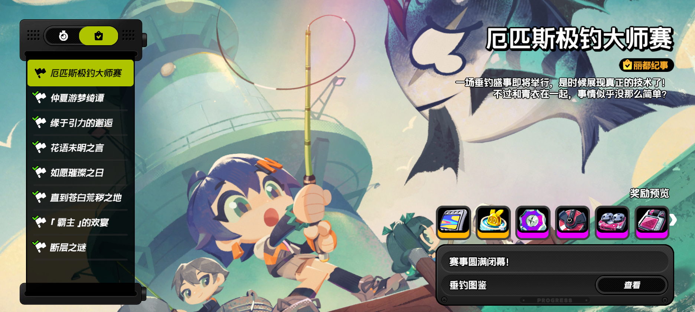
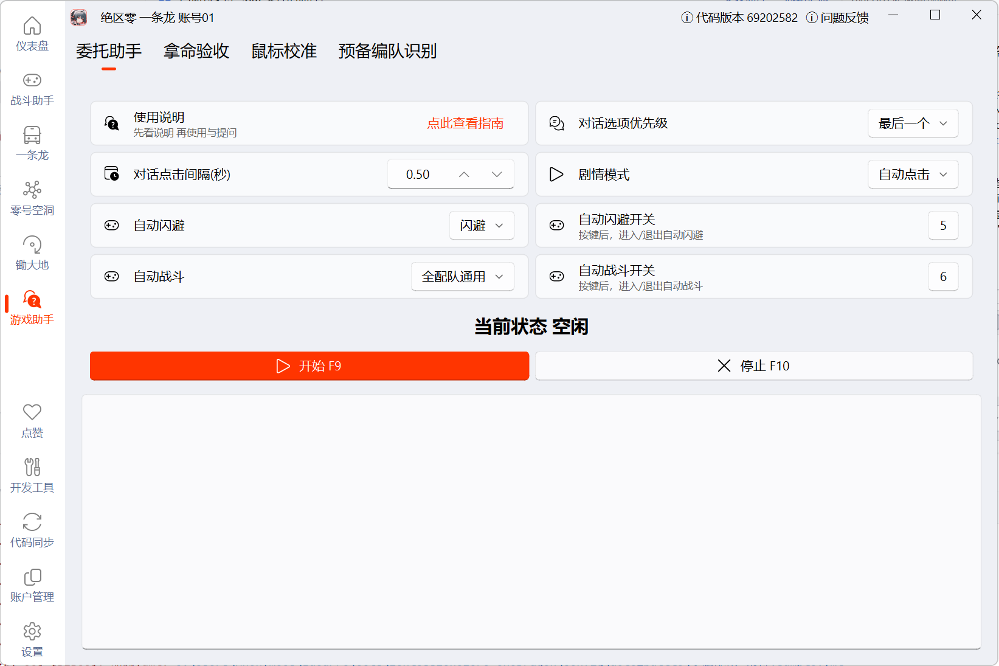

使用本页说明的功能时，建议阅读以下内容：
::: important
- 不同标签页功能不可同时启用
- 开启后走路不正常说明你没有正确关闭这个功能
:::

## 快速开始-游戏助手

游戏助手主要集成一些实用的独立功能。

>点击名字可跳转对应功能的详细说明

|  功能   | 说明  |
|  ----  | ----  |
| [战斗助手](#战斗助手) | 包含自动战斗和闪避助手 |
| [委托助手](#委托助手) | 自动钓鱼/自动战斗/自动点击剧情 |

## 战斗助手

目前结合了 画面识别 和 [声音识别](https://github.com/ImLaoBJie/ZZZSoundTrigger)。
如果觉得好用，欢迎给原项目点赞。

- **自动战斗** 作用于一条龙的所有战斗场景
- **闪避助手** 可以辅助闪避来降低游戏难度。

### 相关配置

1. 战斗配置：脚本的操作逻辑，默认建议使用 `「全通用配置」`
    - 配队选择：根据配队类型分别为`全配对通用/专属配队/战斗逻辑配队`。
    - 全配队通用 - 适用于大部分角色的通用配置，对队伍搭配没有要求。
    - 专属配队 - 适用于特定角色队伍的专属配置，请确定脚本的开发时间，是否为过时未维护的脚本。
    - 战斗逻辑配队 - 适用于特定战斗逻辑的配置。
2. 闪避方式：会自动检测游戏画面中的闪光进行应对，按需选择（见 [闪避助手详细说明](auto_battle_guide/reference/tips_and_debug.md#闪避助手开发)）。
3. GPU运算：开启后脚本会使用 GPU 进行画面识别，通常可以提高识别速度和准确率。
4. 截图间隔：能正常使用就不要修改，截图检测间隔，默认 0.02 秒。
5. 操作类型：支持键鼠和手柄两种操作方式，默认键鼠。
    - 键鼠，目前适配了大部分键盘按键
    - 手柄，目前[手柄支持](feat_gamepad.md)支持 `Xbox` 和 `DS4`，需安装手柄驱动。
    - 游戏内若自定义过按键，请在脚本的 `「设置」-「游戏设置」-「按键设置」` 内进行同步修改。

## 委托助手

用于辅助完成游戏内的剧情与战斗。
目前集成了战斗助手、自动剧情点击和自动钓鱼功能

- **对话选项优先级/对话间隔/剧情模式** 按需选择
- **自动闪避/自动战斗** 不可同时启用，详细配置说明参考 [战斗助手](#战斗助手)
- **自动钓鱼** 进入活动的钓鱼界面时，直接启用委托助手，即可自动钓鱼

### 相关配置

1. 对话选项优先级：通常第一个选项将转移到下一个区域，最后一项则将停留在当前。请结合实际剧情使用。
2. 对话点击间隔：就是间隔多少秒点击一次，默认为0.5秒。以下场景不会进行点击：
    - 进入了自动闪避/自动战斗模式后
    - 在大世界画面时
    - 左上角有返回按钮时（大多数可操作非对话的页面都有）
3. 剧情模式：部分剧情可开启自动播放，此时可选择`自动点击/等待剧情自动播放/跳过剧情`。
    - 自动点击：自动点击对话选项。
    - 等待剧情自动播放：使用游戏内自动播放。
    - 跳过剧情：直接跳过剧情。
4. 自动闪避开关：按键后进入/退出自动闪避模式。退出后才可以进入自动战斗模式。
5. 自动战斗开关：按键后进入/退出自动战斗模式。退出后才可以进入自动闪避模式。
6. 钓鱼详解

 隐藏功能-钓鱼详解

钓鱼功能仅限厄匹斯堡钓鱼场景（近岸钓点 长桥钓点 深水钓点 石礁钓点）

- 进入你想钓鱼的场地，出现钓鱼的几个元素（抛杆、钓鱼）

- 进入委托助手，点击`▶️开始`启动委托助手

（对 就点这儿 没有钓鱼是正常的 你就点开始就完了）
- 双手离开键盘。app会自动锁定zzz屏幕焦点。

工作原理：

1. 查找钓鱼界面的"返回"按钮
2. OCR识别指令文本区域，查找"点击按键抛竿"文字
3. 如果两个条件都满足，确认进入钓鱼模式

支持的关键字：

1. 点击按键抛竿

按下交互键（0.2秒）
2. 等待上鱼

等待状态，无操作

3. 正确时机点击按键上鱼

检测到时机提示后按交互键

4. 连点

快速连续按键操作

5. 长按

长按指定方向键

  <button onclick="this.closest('details').open=false">收纳</button>

**相关帖子**：[如何使用自动钓鱼（老钓鱼）功能？](https://pd.qq.com/s/295t2aif1?b=2)
