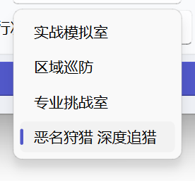

用于设置 `体力刷本` 的计划，每次自动战斗刷取素材

1. 循环执行：开启后，将循环执行到体力用尽
2. 跳过计划：开启后，将跳过体力不足部分的体力计划
3. 使用家政券：开启后将允许定期清缴功能使用家政券
4. 新增体力计划：用于添加需要刷取的副本
   - 副本类型（如：实战模拟室，专业挑战室等）
   - 副本刷取内容（如：驱动盘，挑战的BOSS等）
   - 副本刷取编队，选择战斗使用的[预备编队](../feat_game_assistant.md#预备编队)
   - 计划次数：当前副本计划刷取的次数（填为0时将停止当前副本的刷取）

> 体力计划内的 `恶名狩猎 深度追猎` 是 **深度追猎** 模式
>
> 需要每周三次恶名狩猎打完才可以使用
>
> 
