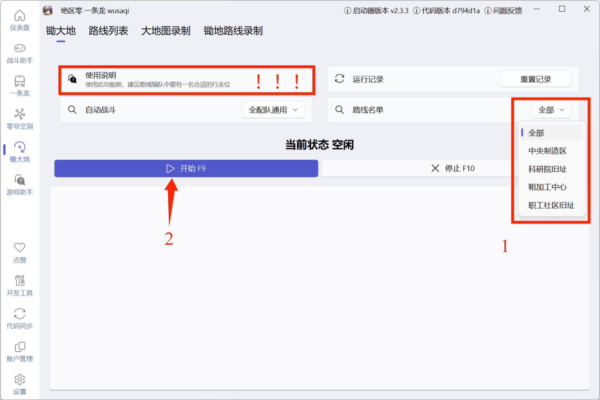

## 使用前需知

使用本页说明的功能时，建议阅读以下内容：
:::important
- 锄大地功能意见或问题，请前往[issue](https://github.com/OneDragon-Anything/ZenlessZoneZero-OneDragon/issues)或[PR](https://github.com/OneDragon-Anything/ZenlessZoneZero-OneDragon/pulls)
- 首次使用前，建议运行一次位于 `游戏助手` 内的 `鼠标校准`
:::

用于自动打绝区零大世界里的野怪，获得丁尼、代理人经验和音擎经验材料

使用此功能前，建议勘域编队中要有一名合适的行走位（~~身高不挡传送点~~，速度越慢越好）

每次触发自动战斗后，自动从队伍中获取最适合移动的角色

> 来源：[auto_battle_utils.py](https://github.com/OneDragon-Anything/ZenlessZoneZero-OneDragon/blob/main/src/zzz_od/auto_battle/auto_battle_utils.py)

锄大地主体由[自动战斗](../feat_battle_assistant.md)和[路线列表](#路线列表)两部分组成，可使用已有配置或自行创建配置

**支持区域**：莱姆尼安空洞

**相关帖子**：[锄大地使用方法](https://pd.qq.com/s/cofn3sf28?b=2)

## 锄大地录制

### 路线列表

1. 点击 `名单选择` 右侧的框，选择白名单/黑名单模式
2. 点击 `新建` 创建路线，输入路线名称
3. 选择区域添加已有路线(当前有且仅有莱姆尼安空洞)
4. 添加完成后点击 `保存` ，即可在路线名单内找到并运行

### 大地图录制

> 待施工

### 锄地路线录制

> 待施工
