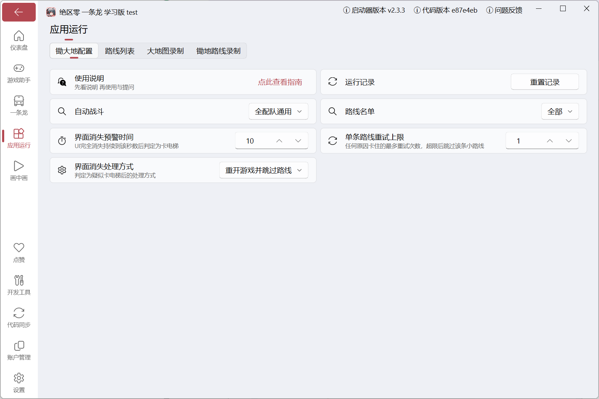

使用本页说明的功能时，建议阅读以下内容：
:::important

- 锄大地功能意见或问题，请前往[issue](https://github.com/OneDragon-Anything/ZenlessZoneZero-OneDragon/issues)或[PR](https://github.com/OneDragon-Anything/ZenlessZoneZero-OneDragon/pulls)
- 首次使用前，建议运行一次[灵敏度校准](./onedragon.md#灵敏度校准)
- 路线相关功能（`路线列表`、`大地图录制`、`锄地路线录制`）属于进阶/开发向功能，绝大多数用户无需自行录制或编辑名单，[锄大地配置](#锄大地配置)的 `路线名单` 保持默认 `全部` 即可。仅在需要补充新区域、修正路线或自定义运行范围时，才需要用到这些内容
:::

## 功能说明

用于自动前往 `航天城` 清理野怪完成锄大地，获得丁尼、代理人经验和音擎经验材料

使用此功能前，建议勘域编队中要有一名合适的行走位（~~身高不挡传送点~~，速度越慢越好）

每次触发自动战斗后，自动从队伍中获取最适合移动的角色

> 来源：[auto_battle_utils.py](https://github.com/OneDragon-Anything/ZenlessZoneZero-OneDragon/blob/main/src/zzz_od/auto_battle/auto_battle_utils.py)

锄大地主体由[自动战斗](../feat_game_assistant.md#战斗助手)和[路线列表](#路线列表)两部分组成，可使用已有配置或自行创建配置

**支持区域**：莱姆尼安空洞

**相关帖子**：[锄大地使用方法](https://pd.qq.com/s/cofn3sf28?b=2)

## 配置说明

### 锄大地配置

在 `锄大地配置` 标签页中，可对运行行为进行设置。一般情况下使用默认配置即可，下面对各配置项做说明。

| 配置项 | 说明 |
| ---- | ---- |
| 运行记录 | 点击 `重置记录` 可清空当天已完成路线的记录，方便重新运行 |
| 自动战斗 | 选择锄大地过程中触发战斗时使用的自动战斗配置，默认为 `全配队通用`，配置方式详见 [自动战斗](../feat_game_assistant.md#战斗助手) |
| 路线名单 | 选择运行时使用的[路线名单](#路线列表)，默认 `全部`（即不做名单过滤，运行所有路线） |
| 界面消失预警时间 | 当游戏界面（UI）完全消失并持续到设定秒数后，判定为 `疑似卡电梯`。默认 `10` 秒，最大 `999` 秒 |
| 单条路线重试上限 | 单条路线因任何原因卡住时的最大重试次数，超过后跳过该条路线。默认 `1` |
| 界面消失处理方式 | 判定为疑似卡电梯后的处理方式。可选：`静默失败`（默认，直接判定当前路线失败并跳过，不重开游戏）、`重开游戏并跳过路线`（自动关闭并重新打开游戏，然后跳过当前路线）、`重开游戏并重试路线`（自动关闭并重新打开游戏，在 `单条路线重试上限` 范围内重新尝试当前路线，超限后才跳过） |

::: tip
若选择带 `重开游戏` 的处理方式，需要确保已正确配置游戏路径，否则脚本无法重新打开游戏。
:::

### 路线列表

`路线列表` 用于把录制好的路线组合成一份名单，供 [锄大地配置](#锄大地配置) 的 `路线名单` 选择运行。

1. 点击 `名单选择` 右侧的框，选择白名单/黑名单模式
2. 点击 `新建` 创建路线，输入路线名称
3. 选择区域添加已有路线(当前有且仅有莱姆尼安空洞)
4. 添加完成后点击 `保存` ，即可在路线名单内找到并运行

更多操作说明：

- **名单类型**：`白名单` 表示只运行名单内的路线；`黑名单` 表示运行除名单内以外的所有路线。
- **添加路线**：在 `区域选择` 选好区域后，下方 `当前区域可用路线` 会列出该区域所有路线。可选中单条后点 `添加单条路线`，或直接点 `添加整个区域` 一次性加入。
- **顺序调整**：在上方 `路线列表` 中选中某条路线，用 `上移`/`下移` 调整运行顺序，`移除` 将其从名单中删除。
- **保存/删除**：编辑完成后点击 `保存`；`删除` 可删除整份名单，`取消` 放弃当前编辑。

### 大地图录制

`大地图录制` 用于拼接出一个完整区域的大地图，作为路线录制的底图。原理是：在游戏中转动视角，脚本对小地图进行截图、识别道路，并不断合并到一张大地图上。

操作步骤：

1. **选择区域**：在 `区域` 行依次选择 `入口` 和具体 `区域`。
2. **加载/重置**：点击 `加载` 读取该区域已有的大地图数据；若不存在则会新建一张空地图。已加载后按钮变为 `重置`。
3. **首次缩放（仅第一次需要）**：在 `缩放` 中填入百分比（默认 `40`）后点击 `应用`，用于把地图调整到合适大小。后续在同一张地图上继续录制时无需再调整。
4. **截图(1)**：进入游戏对应区域后，点击 `截图` 或按快捷键 `1`。脚本会截取当前小地图，自动转身 180° 再截一次，并把两次结果合并，得到一段较完整的小地图道路。
5. **定位(2)**：点击 `定位` 或按 `2`，脚本会根据上一次的坐标，计算当前小地图在大地图上的位置。
    - 若计算前没有任何坐标，需先在右侧大地图上 **点击** 一个大致位置作为起点。
    - 勾选 `使用图标计算坐标` 可借助地图图标辅助定位；`图标匹配阈值`（默认 `0.7`）可在识别不准时微调。
6. **微调**：定位结果不准时，可用 `角色坐标` 行的 `横移`/`纵移` 输入像素值进行平移修正。
7. **重叠(3)**：点击 `重叠` 或按 `3`，切换小地图在大地图上的叠加显示方式，便于核对拼接是否对齐。
8. **合并(4)**：确认位置无误后，点击 `合并` 或按 `4`，把这段小地图正式合并进大地图。`回退` 可撤销上一次合并（只能撤销一次）。
9. **重复 4~8**：在游戏中移动到相邻位置，重复截图、定位、合并，逐步把整个区域拼完整。
10. **编辑图标**：点击 `编辑图标` 打开图标编辑器，可增删、调整地图上的传送点等图标（传送点对应模板 `map_icon_01`，是后续录制路线选择起点的依据）。
11. **保存**：完成后点击 `保存` 写入数据；`删除` 可删除该区域的大地图，`取消` 放弃当前编辑。

### 锄地路线录制

`锄地路线录制` 在已录好的大地图上，逐点记录角色坐标，生成一条从传送点出发的移动路线。录制完成的路线可在 [路线列表](#路线列表) 中组合成名单后运行。

操作步骤：

1. **选择路线**：在 `路线` 行依次选择 `入口`、`区域`，对应区域的大地图会自动加载。已有路线会在第三个下拉框中列出（格式为 `序号 - 传送点 (步数)`）。
2. **选择传送点**：在 `传送点` 行选择本条路线的起始传送点（来源于大地图中标注的 `map_icon_01` 图标）。
3. **新增**：点击 `新增` 基于所选传送点创建一条新路线（需先选好区域和传送点）。
4. **记录移动点**，有两种方式：
    - **截图(1)**：在游戏中移动到目标位置后点击 `截图` 或按 `1`，脚本识别当前小地图坐标并自动追加一个移动点。
    - **大地图点击**：直接在右侧大地图上点击目标位置。开启 `点击后自动追加移动` 时，点击即追加移动点；关闭时则需再点 `添加移动(4)` 或按 `4` 确认。
5. **回退(5)**：点击 `回退` 或按 `5`，删除最后一个移动点。
6. **编辑操作**：点击 `编辑操作` 打开表格编辑器，可逐条查看/修改移动点的坐标（数据1为 X、数据2为 Y），并支持添加、删除、上移、下移。
7. **调试**：在 `调试` 行可填入起始步数（`0` 表示需要先传送，`1` 表示已完成第 1 步），点击 `调试` 让脚本实际运行该路线进行验证。
8. **保存**：确认无误后点击 `保存`。`删除` 删除当前路线，`取消` 放弃当前编辑。

> 右侧大地图会实时可视化路线：黄/青色圆圈为起始传送点，绿色圆圈与连线为各移动点及其顺序。
