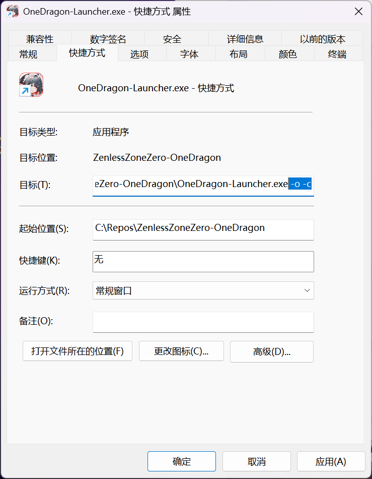

使用本页说明的功能时，建议阅读以下内容：

::: important

- 请使用最新版本安装包，旧安装包可能无法兼容当前代码或运行环境
- [确认安装包最新版本](https://github.com/OneDragon-Anything/ZenlessZoneZero-OneDragon/releases)
- [确认代码最新版本](https://github.com/OneDragon-Anything/ZenlessZoneZero-OneDragon/commits/main/)

:::

## 1.环境检查

### 硬件

建议使用较新的电脑。本项目需要运行 OCR 和专用识别模型，会在游戏之外额外占用 CPU、内存和显卡资源。

<details>
<summary>查看硬件说明</summary>

根据《绝区零》[官方公告](https://zzz.mihoyo.com/news/124528?category=279)，推荐配置为第十代 Intel Core i5、8 GB 内存、NVIDIA GeForce GTX 1660 及以上；AMD 设备可参考同级性能配置。

一条龙还需要额外进行截图、OCR 和模型推理。配置较低、缺少必要指令集或游戏本身运行不流畅时，可能出现识别延迟、操作超时或战斗表现下降。

</details>

### 系统

使用 Windows 10 64 位或更高版本。安装目录建议放在固态硬盘，并使用纯英文、无空格的路径，例如 `D:\ZZZ-OD`。

### 网络

首次安装、代码同步、环境下载和模型更新都可能需要网络。`Full-Environment` 完整包可以减少环境下载，但不能完全替代后续的代码和资源更新。

运行失败时，可通过下方链接确认网络连通性。

<details>
<summary>查看常用连接测试地址</summary>

每个大类至少要有一个地址可以访问。

- 代码仓库
  - [GitHub](https://github.com/OneDragon-Anything/ZenlessZoneZero-OneDragon)
  - [Gitee](https://gitee.com/OneDragon-Anything/ZenlessZoneZero-OneDragon)
- Python/Pip
  - [官方pip源](https://pypi.org/)
  - [清华pip镜像源](https://mirrors.tuna.tsinghua.edu.cn/help/pypi/)
  - [阿里云pip镜像源](https://mirrors.aliyun.com/pypi/)

如果同类地址都无法访问，可尝试切换安装器中的区域预设、下载源或网络代理，也可以临时使用手机热点排查本机网络问题。

</details>

## 2.下载安装

请根据需要<font color="red">只选择以下一种安装方式</font>，选定后只按照对应标题下的步骤操作，不要混用其他安装方式的文件，也不要下载 GitHub Release 页面自动生成的 `Source code`。

::: tip 不知道怎么选？

普通用户推荐使用“集成启动器”：首次安装请下载带版本号的 `WithRuntime.zip`，解压后运行即可。

无论使用哪种方式，安装和环境同步都需要下载或解压较多文件，请等待当前步骤明确完成。安装失败时会自动打开[排障文档](https://docs.qq.com/doc/p/7add96a4600d363b75d2df83bb2635a7c6a969b5)。

:::

### 集成启动器（推荐，解压即用）

1. 下载
   - 从 [GitHub Release](https://github.com/OneDragon-Anything/ZenlessZoneZero-OneDragon/releases) 下载 `ZenlessZoneZero-OneDragon-<版本>-WithRuntime.zip`
   - 也可以使用 [Mirror酱](https://mirrorchyan.com/zh/projects?rid=ZZZ-OneDragon&arch=x64&channel=stable)（需要 Mirror CDK，选择 `x64`）
   - 安装包已经包含运行环境和程序代码，不需要安装 Python 或 uv
   - 首次安装不能使用不带版本号的 `RuntimeLauncher.zip`，该压缩包只用于更新已有环境
2. 解压
   - 将压缩包完整解压到最终目录
   - 不要单独移动 `OneDragon-RuntimeLauncher.exe`，也不要删除同一目录下的 `.runtime` 或 `src` 文件夹
3. 启动
   - 运行 `OneDragon-RuntimeLauncher.exe`
   - 第一次打开会自动补齐并更新程序文件，需要保持网络连接
   - 后续启动会根据 `自动更新` 设置检查程序更新
4. 后续更新
   - `ZenlessZoneZero-OneDragon-RuntimeLauncher.zip` 只用于更新已有的集成启动器环境
   - 首次安装不能使用该更新包，必须下载带版本号的 `WithRuntime.zip`

### 原始启动器（安装器引导安装）

1. 下载
   - 从 [GitHub Release](https://github.com/OneDragon-Anything/ZenlessZoneZero-OneDragon/releases) 下载
   - 也可以使用 [Mirror酱](https://mirrorchyan.com/zh/projects?rid=ZZZ-OneDragon&arch=arm64&channel=stable)（需要 Mirror CDK，选择 `arm64`）
   - 不知道选哪个：下载 `ZenlessZoneZero-OneDragon-<版本>-Full-Environment.zip`，需要额外下载的内容最少
   - 可以联网下载运行环境：下载 `ZenlessZoneZero-OneDragon-<版本>-Full.zip`
   - 只下载精简安装器、其余内容联网获取：下载 `ZenlessZoneZero-OneDragon-<版本>-Installer.exe`
2. 运行安装器
   - 以管理员身份运行 `OneDragon-Installer.exe`，选择最终安装目录
   - 不能选择磁盘根目录
   - 路径必须为纯英文且不能包含空格
   - 目标目录不为空时，安装器会提示内容可能被覆盖；首次安装建议使用空目录
   - 安装器与目标目录不同时，会按照安装清单搬运并校验文件
3. 配置下载源
   - 选择区域预设，或在高级配置中分别调整下载源和网络代理
   - `GitHub 代理`：通过免费代理地址加速 GitHub 下载
   - `个人代理`：使用本机代理软件的监听地址，例如 `http://127.0.0.1:7890`
   - `无`：适用于可以直接访问下载源，或代理已经配置在路由器、系统网络中的情况
   - 安装器提供 `中国 - Gitee`、`中国 - GitHub 代理` 和 `海外` 三种区域预设，也可以在高级配置中分别调整代码仓库、环境下载源、Python 下载源和 Pip 源
   - 如果镜像站拒绝代理流量，请切换到官方源
4. 开始安装
   - `一键安装`：依次完成代码同步、uv、Python、虚拟环境、运行依赖和原始启动器安装
   - `自定义安装`：按 `代码同步 → 环境配置 → 安装启动器` 逐步执行，适合排查具体失败环节
5. 扩展安装
   - 基础安装完成后会进入可选的 `扩展安装`
   - 当前扩展项为虚拟手柄，需要后台模式或相关功能时再安装
   - 安装过程中可能弹出驱动安装提示，按正常安装流程继续即可
6. 启动
   - 安装完成后点击 `启动程序`
   - 之后也可以直接运行 `OneDragon-Launcher.exe`
   - 安装器不参与日常运行，安装完成后可以删除；需要重新安装或修复环境时再下载

### 源码运行

适合需要修改代码或参与开发的用户，普通用户优先使用集成启动器或安装器。

不需要下载安装包，按照下方步骤从 [GitHub 仓库](https://github.com/OneDragon-Anything/ZenlessZoneZero-OneDragon)克隆代码并运行。

<details>
<summary>查看源码运行步骤</summary>

1. 安装 uv

   ```powershell
   powershell -c "irm https://astral.sh/uv/install.ps1 | iex"
   ```

   安装完成后，如果当前 PowerShell 仍然找不到 `uv`，请重新打开 PowerShell。

2. 创建并进入安装目录

   ```powershell
   $targetDir = "C:\Repos"
   New-Item -ItemType Directory -Path $targetDir -Force | Out-Null
   Set-Location $targetDir
   ```

3. 克隆仓库

   ```powershell
   git clone https://github.com/OneDragon-Anything/ZenlessZoneZero-OneDragon.git
   ```

4. 进入项目目录

   ```powershell
   cd ZenlessZoneZero-OneDragon
   ```

5. 同步 Python 和运行依赖

   ```powershell
   uv sync
   ```

6. 设置当前 PowerShell 会话的源码路径

   ```powershell
   $env:PYTHONPATH = ".\src"
   ```

7. 启动程序

   ```powershell
   uv run python .\src\zzz_od\gui\app.py
   ```

</details>

## 3.首次启动

启动 EXE 时如果出现 Windows 管理员权限提示，请选择 `是`。原始启动器会在打开主界面前检查程序代码和运行依赖；集成启动器会检查程序代码，并直接使用自带运行环境启动程序。

首次进入主界面后，请按照[必要设置](./config.md)配置游戏路径、区服、按键、识别模型等内容。启动失败时参考[常见问题](./faq.md)。

## 4.脚本如何更新

1. 运行代码
   - 更新方式：
     - <font color="red">使用 EXE 启动时自动检测并更新</font>
     - <font color="red">点击主界面左侧底部的 `代码同步` 可手动更新，也可以切换分支或开启 `强制更新`</font>
   - 关闭 `自动更新` 后，启动器会跳过自动代码更新
   - 如果提示 `运行环境不兼容`，请更新集成启动器；仍无法更新时，重新下载新版 `WithRuntime.zip`
   - [CNB](https://cnb.cool/OneDragon-Anything/ZenlessZoneZero-OneDragon) 仅作为项目代码的同步镜像，不参与启动器自动更新；启动器内的 `代码源` 仍选择 GitHub 或 Gitee
2. 启动器
   - 在 `设置 → 资源下载` 中选择 `原始启动器` 或 `集成启动器`，再选择稳定版或测试版进行更新
   - 手动更新时，原始启动器使用 `Launcher.zip`，集成启动器使用 `RuntimeLauncher.zip`
3. 识别模型
   - 在 `设置 → 资源下载` 中更新 OCR、闪光识别、空洞格子识别和迷失之地识别模型
   - 模型名称后的数字通常代表版本日期，优先选择较新的兼容版本
4. 重新安装或修复
   - 集成启动器：重新下载当前版本 `WithRuntime.zip`
   - 原始启动器：重新下载当前版本安装器或完整包
   - 源码运行：重新执行 `uv sync`；代码目录损坏或无法正常同步时，再重新克隆仓库

## 5.高级启动参数

启动参数分为“游戏启动参数”和“一条龙启动器参数”，两者用途不同。

1. 游戏启动参数
   - 在[`设置 → 游戏设置`](./setting/setting_game.md)中配置分辨率、窗口模式、显示器、画质预设和其他 Unity 参数
   - 这些参数只在一条龙自动拉起《绝区零》时生效；游戏已经运行时不会重新应用
   - 自定义 Unity 参数可参考[Unity 命令行文档](https://docs.unity3d.com/Manual/PlayerCommandLineArguments.html)
2. 一条龙启动器参数
   - `OneDragon-Launcher.exe` 与 `OneDragon-RuntimeLauncher.exe` 使用相同参数
   - 适合创建快捷方式、任务计划或自动运行脚本
   - 使用 `-o` 时，程序会直接执行一条龙；请先在主界面配置正确的游戏路径和账号实例

   ```text
   options:
     -h, --help            显示帮助信息
     -v, --version         显示版本号
     -o, --onedragon       一条龙运行
     -c, --close-game      运行后关闭游戏
     -s [SHUTDOWN], --shutdown [SHUTDOWN]
                           运行后关机，可指定延迟秒数，默认 60 秒
     -i INSTANCE, --instance INSTANCE
                           指定运行的账号实例，多个用英文逗号分隔，如 1,2
   ```

   例如，一条龙运行结束后关闭游戏：

   ```powershell
   OneDragon-Launcher.exe -o -c
   ```

   集成启动器使用相同写法：

   ```powershell
   OneDragon-RuntimeLauncher.exe -o -c
   ```


